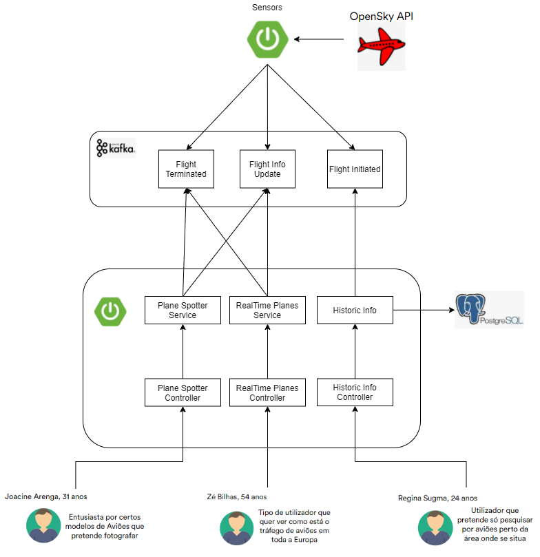
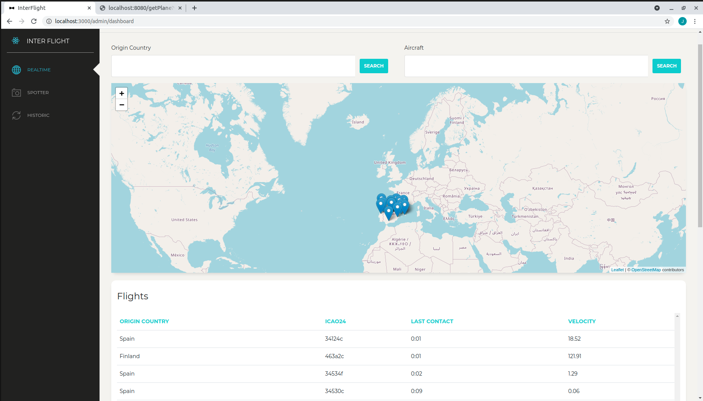

# ES_InterFlight

Spring Boot aplication  
Fetch data from external api, process it and display data in a different way.
Deployed using Docker and Jenkins.

### Architecture

### FrontEnd

#Sensors

Fazer docker compose up dos sensors e depois executar a app no netbeans(falta meter a app no docker compose)

#InterFlight

Fazer docker compose para a base de dados e depois executar a app 

Como as apps ainda n estao em containers, as duas apps correm no mesmo port 8080

